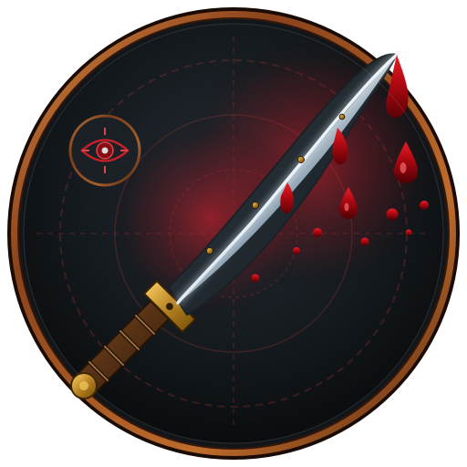
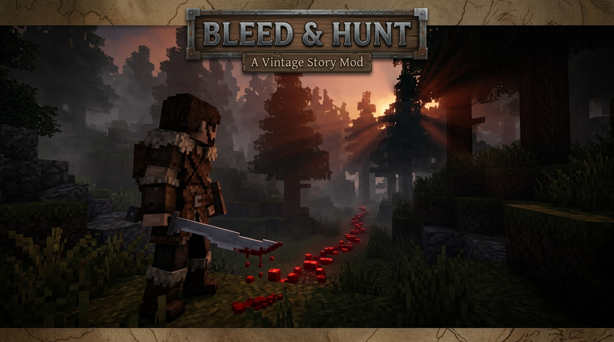
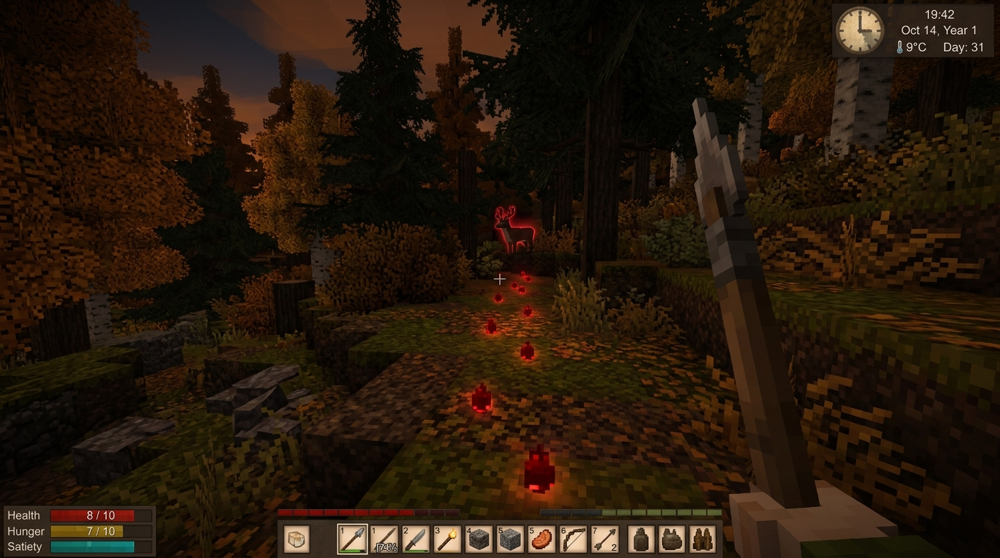
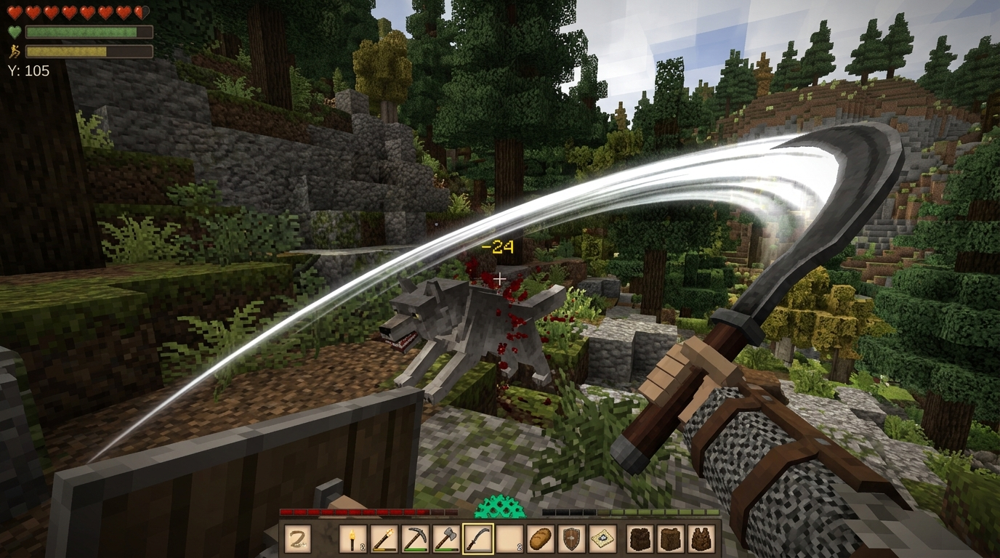
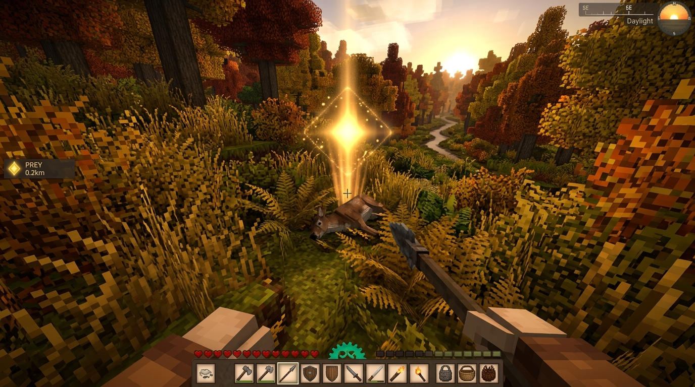
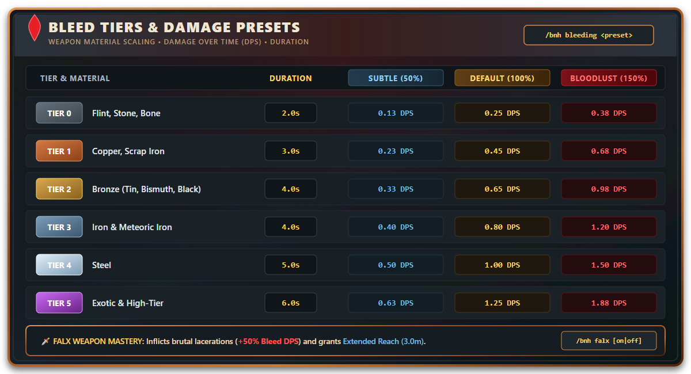

<div align="center">



# 🩸 Bleed & Hunt
### *Visceral Wounds • Blood Trail Tracking • Prey Limping • Melee Sweeps*

[](https://github.com/Shurielx/Bleed-Hunt/releases)
[](https://mods.vintagestory.at/)
[](https://github.com/Shurielx/Bleed-Hunt)
[](https://dotnet.microsoft.com/)
[](https://opensource.org/licenses/MIT)

<br />

**Bleed & Hunt** overhauls combat, hunting, and tracking mechanics in **Vintage Story**. Inflict scaling bleed wounds based on weapon material tiers, stalk wounded game by glowing crimson blood trails and hunter's instinct scent, watch injured prey limp in desperation, and cleave through moving targets with a forgiving melee sweep assist.

[📦 Download Mod](https://github.com/Shurielx/Bleed-Hunt/releases) • [✨ Features](#-features) • [🐾 Tracking & Combat](#-showcase--mechanics) • [⚔️ Bleed Tiers](#-bleed-tiers--presets) • [📜 Commands](#-commands) • [⚙️ Configuration](#-configuration)

<br />



</div>

---

## ✨ Features

* 🩸 **Progressive Bleeding Over Time:** Weapons inflict damage-over-time wounds scaled by material tier (from crude Flint up to forged Steel and exotic blades). Re-striking refreshes and intensifies the bleed timer.
* 🐾 **Dynamic Blood Trails:** Wounded animals drop faint, glowing red voxel blood droplets onto the ground, leaving an unmistakable trail to track through dense grass and brush.
* 👁️ **Hunter's Scent Vision:** Injured prey is highlighted through foliage and terrain with a subtle crimson outline for 30 seconds (up to 64 blocks away), giving you true hunter instincts.
* 🦵 **Limping & Execute Damage:** Prey slows down progressively as its vitality drains (down to 50% speed at low health) and takes **1.25x execute bonus damage** when wounded below half health.
* 🎯 **Golden 3D Cone Marker:** Downed game emits an animated, rotating 3D golden cone beacon pointing directly to the quarry for 10 seconds, ensuring your harvest is never lost in tall autumn grass or murky swamps.
* ⚔️ **Forgiving Melee Sweep Cone:** Swords, knives, falx blades, and spears feature a 22° attack cone assist so agile targets aren't missed by a pixel.
* 🗡️ **Falx Synergy & Reach:** Falx weapons inflict **+50% bonus bleed damage** over time and gain extended forward reach (3.0m). Both bonuses can be toggled via chat commands or the ConfigKit GUI.
* 🚀 **Zero-Overhead Performance:** Ultra-efficient architecture with zero-cost idle state (returns in 1 nanosecond for untargeted mobs) and 5Hz low-frequency cached rendering.
* 🌐 **Multiplayer Ready:** Fully synchronized across dedicated servers and clients with zero desync.

---

## 📸 Showcase & Mechanics

### 🐾 Blood Trails & Hunter's Scent
> Track wounded prey across any terrain. Bleeding animals leave glowing crimson blood droplets on the ground, while your primal hunter instincts outline their silhouette through trees and brush.

<p align="center">
  
</p>

---

### ⚔️ Dynamic Melee Sweep & Falx Mastery
> Never miss an agile wolf or fleeing rabbit again. Melee weapons have a lateral sweep cone, while the Falx blade gains extended reach and enhanced laceration power.

<p align="center">
  
</p>

---

### 🎯 Golden Kill Marker in Brush
> No more lost carcasses! When a hunted beast falls, a luminous amber-gold beacon hovers above its body for 10 seconds to guide you directly to your quarry.

<p align="center">
  
</p>

---

## ⚔️ Bleed Tiers & Presets

Wounds scale with the quality of metal you forge. Switch between presets dynamically using `/bnh bleeding <preset>` or via the ConfigKit GUI.

<p align="center">
  
</p>

<details>
<summary><b>▶ Click to view text table</b></summary>

| Tier | Materials | Duration | Subtle (50%) | Default (100%) | Bloodlust (150%) |
| :---: | :--- | :---: | :---: | :---: | :---: |
| 🪨 **Tier 0** | Flint, Stone, Bone | **2s** | `0.13 DPS` | `0.25 DPS` | `0.38 DPS` |
| 🪓 **Tier 1** | Copper, Scrap Iron | **3s** | `0.23 DPS` | `0.45 DPS` | `0.68 DPS` |
| 🥉 **Tier 2** | Bronze (Tin, Bismuth, Black) | **4s** | `0.33 DPS` | `0.65 DPS` | `0.98 DPS` |
| ⚔️ **Tier 3** | Iron, Meteoric Iron | **4s** | `0.40 DPS` | `0.80 DPS` | `1.20 DPS` |
| 🛡️ **Tier 4** | Steel | **5s** | `0.50 DPS` | `1.00 DPS` | `1.50 DPS` |
| ⚡ **Tier 5** | Exotic / High-tier | **6s** | `0.63 DPS` | `1.25 DPS` | `1.88 DPS` |

</details>

> [!TIP]
> **Falx Weapon Mastery:** Wielding a Falx grants brutal lacerations (**+50% Bleed DPS** [e.g. Tier 2 deals ~0.98 DPS instead of 0.65 DPS]) and increases forward attack reach to **3.0 blocks**. These bonuses can be customized or toggled off anytime with `/bnh falx [on|off]` or inside the ConfigKit GUI.

---

## 📜 Commands

You can configure and customize settings in real-time through the in-game chat using `/bnh`:

| Command | Arguments | Description |
| :--- | :--- | :--- |
| `/bnh help` | *none* | Displays current mod configuration and available commands. |
| `/bnh xray` *(or `/bnh scent`)* | `animals` \| `monsters` \| `all` \| `on` \| `off` | Configure target filter or toggle Hunter's Scent outline. |
| `/bnh betterrange` *(or `/bnh sweep`)* | `on` \| `off` | Toggle the melee attack sweep assist cone. |
| `/bnh falx` | `on` \| `off` \| `bleed [on\|off]` \| `range [on\|off]` \| `both` | Toggle or configure falx weapon bonuses (bleed & reach). |
| `/bnh bleeding` | `default` \| `subtle` \| `bloodlust` \| `off` | Adjust global bleed intensity preset or disable bleed. |
| `/bnh opacity` | `5` – `100` *(e.g. `25` or `25%`)* | Fine-tune the transparency of the hunter outline aura. |

> [!NOTE]
> Settings adjusted via chat commands or the ConfigKit GUI are saved persistently in `ModConfig/BleedAndHuntConfig.json`.

---

## ⚙️ Configuration & In-Game GUI

Bleed & Hunt offers two convenient ways to customize settings:

1. 🎮 **In-Game GUI (ConfigKit):** If you have [ConfigKit](https://mods.vintagestory.at/configkit) installed, Bleed & Hunt automatically hooks into the in-game configuration menu. All toggles, sliders, and presets are available directly with visual tooltips!
2. 💬 **Chat Commands (`/bnh`):** Real-time chat commands listed above are always available even without any UI mods.
3. 📝 **JSON Config:** You can edit raw values directly in `%appdata%\VintagestoryData\ModConfig\BleedAndHuntConfig.json`.

<details>
<summary><b>▶ Click to view full configuration schema</b></summary>

```json
{
  "EnableBleeding": true,
  "EnableLimping": true,
  "EnableXRay": true,
  "EnableFalxRangeBoost": true,
  "FalxAttackRange": 3.0,
  "EnableFalxBleedBonus": true,
  "FalxBonusBleedStacks": 1,
  "MaxBleedStacks": 5,
  "Tier0DamagePerSecond": 0.25,
  "Tier1DamagePerSecond": 0.45,
  "Tier2DamagePerSecond": 0.65,
  "Tier3DamagePerSecond": 0.80,
  "Tier4DamagePerSecond": 1.00,
  "Tier5DamagePerSecond": 1.25,
  "Tier0DurationSeconds": 2.0,
  "Tier1DurationSeconds": 3.0,
  "Tier2DurationSeconds": 4.0,
  "Tier3DurationSeconds": 4.0,
  "Tier4DurationSeconds": 5.0,
  "Tier5DurationSeconds": 6.0,
  "EnableBloodParticles": true,
  "XRayDurationSeconds": 30.0,
  "XRayMaxDistance": 64.0,
  "EnableCorpseHighlight": true,
  "CorpseHighlightDurationSeconds": 10.0,
  "EnableBetterRange": true,
  "BetterRangeSweepAngle": 22.0,
  "XRayTargetFilter": "animals",
  "BleedingPreset": "default",
  "LimpThresholdHigh": 0.75,
  "LimpSpeedHigh": 0.75,
  "LimpThresholdLow": 0.50,
  "LimpSpeedLow": 0.50,
  "XRayColorR": 1.0,
  "XRayColorG": 0.08,
  "XRayColorB": 0.12,
  "XRayColorA": 0.20,
  "CorpseColorR": 1.0,
  "CorpseColorG": 0.75,
  "CorpseColorB": 0.1,
  "CorpseColorA": 0.85,
  "BossCodes": [ "erel", "eidolon" ]
}
```

</details>

---

## 📦 Installation

1. Download the latest `BleedAndHunt.zip` from [Releases](https://github.com/Shurielx/Bleed-Hunt/releases).
2. Drop the `.zip` archive directly into your Vintage Story mods directory:
   * **Windows:** `%appdata%\VintagestoryData\Mods`
   * **Linux:** `~/.config/VintagestoryData/Mods`
   * **macOS:** `~/Library/Application Support/VintagestoryData/Mods`
3. Launch **Vintage Story** and enjoy hunting!

---

## 🛠️ Building from Source

Requirements: [.NET 10.0 SDK](https://dotnet.microsoft.com/download) & Vintage Story 1.22.*

```bash
# Clone the repository
git clone https://github.com/Shurielx/Bleed-Hunt.git

# Navigate into project directory
cd Bleed-Hunt

# Build and package the mod zip
dotnet build -c Release
```
The compiled mod package will be automatically created in `releases/BleedAndHunt.zip` and deployed to your local `%appdata%\VintagestoryData\Mods` folder.

---

<div align="center">

Made with ❤️ by **Shuriel** for the **Vintage Story** community.

</div>
